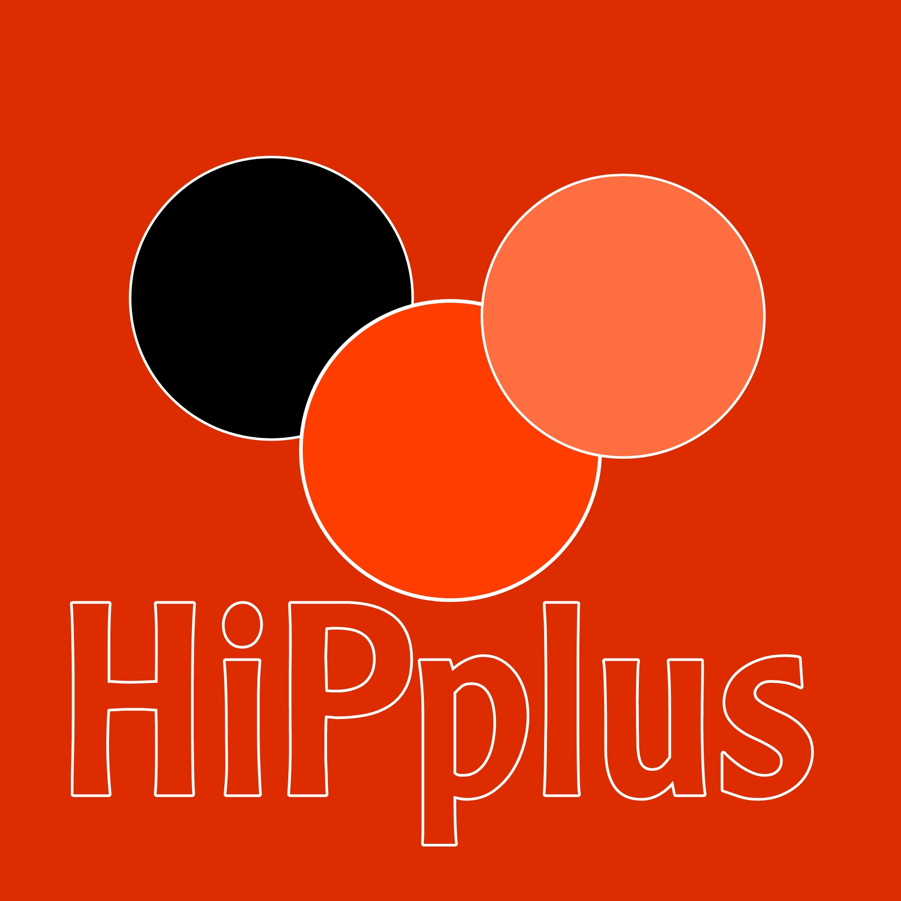

 
# Apm#

[](https://example.com)


[](https://example.com/releases)
[](https://example.com/license)

**Apm#** هي لغة برمجة متقدمة وسهلة الاستخدام لتطوير واجهات المستخدم.

<details>
<summary>عرض خيارات الإخفاء والإظهار</summary>

## الميزات

- **تعريف المكونات:** يمكنك تعريف مكونات واجهة المستخدم مثل الأزرار والنصوص والصور ومقاطع الفيديو بسهولة.
- **تنسيق متقدم:** يدعم **Apm#** تنسيقًا متقدمًا مثل الألوان والحجم والشكل والنمط.
- **أحداث متعددة:** يمكنك تحديد الأحداث مثل النقر وإظهار القوائم وتبديل الرؤية.

## الأمثلة القوية

### تصميم زر تفاعلي

```apm
.Component["button" \/ type "Click me" \/ text]
```


### عرض نص بتنسيق مميز

```apm
.Component["text" \/ type "Hello, world!" \/ content]
```


### تنظيم واجهة المستخدم بتخطيط مرن

```apm
.Layout[["button", "text"] \/ row1]
```


### التفاعل مع الأحداث

```apm
.Event["click" \/ event_type "showMenu" \/ action]
```


</details>

## الحزمة

يمكنك تثبيت لغة البرمجة **Apm#** باستخدام npm:

```bash
npm install apm-lang
```

## الاستخدام

يمكنك استخدام **Apm#** لتصميم واجهات مستخدم جميلة وتفاعلية. إليك بعض الأمثلة:

| كود Apm#                                                                                                              | نتيجة                                                                                                                   |
| ----------------------------------------------------------------------------------------------------------------------- | ------------------------------------------------------------------------------------------------------------------------ |
| `.Component["button" \/ type "Click me" \/ text]`                                                                      |                                                                        |
| `.Component["text" \/ type "Hello, world!" \/ content]`                                                                |                                                                            |
| `.Layout[["button", "text"] \/ row1]`                                                                                  |                                                                        |
| `.Event["click" \/ event_type "showMenu" \/ action]`                                                                   |                                                                          |

## الإسهام

نحن نرحب بالمساهمات والاقتراحات لتطوير لغة البرمجة **Apm#**. لمساهمة، يرجى فتح طلب سحب (Pull Request) في مستودعنا.

## الرخصة

هذا المشروع مرخص برخصة [MIT](https://example.com/license). يرجى الاطلاع على ملف الرخصة لمزيد من المعلومات.


```

ثم يمكنك إنشاء ملف .gitignore مخصص للغة Apm# بما يلي:

```
